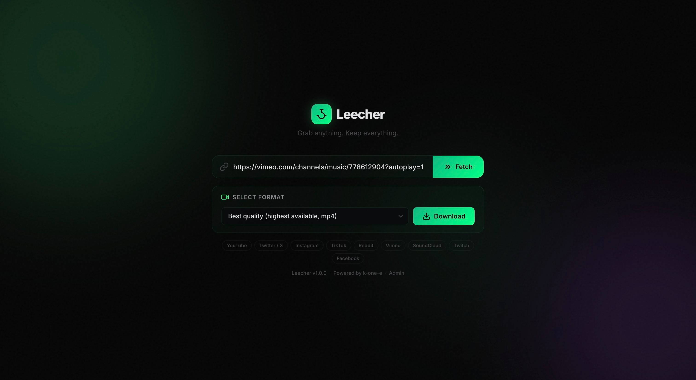

# leecher

Lightweight, self-hosted media downloader with a web UI.

`leecher` lets you paste a link from YouTube, Twitter, Instagram, TikTok, Reddit, and dozens more — pick a format, download it. No cloud, no accounts, no subscriptions — runs entirely on your own hardware, even a Raspberry Pi.



---

## Table of Contents

- [What It Does](#what-it-does)
- [Key Features](#key-features)
- [Quick Start](#quick-start)
- [Configuration](#configuration)
- [Admin Panel](#admin-panel)
- [API Endpoints](#api-endpoints)
- [Disk Protection](#disk-protection)
- [Supported Sites](#supported-sites)
- [Platform Requirements](#platform-requirements)
- [Troubleshooting](#troubleshooting)
- [License](#license)

---

## What It Does

A single binary web server you run on any machine. Open the browser, paste a URL, pick a format, and the file downloads to your server. Everything stays on your hardware.

| Scope | What You See |
|-------|-------------|
| **Main UI** | Paste a link, fetch available formats, pick resolution/codec/size, download |
| **Progress** | Live progress ring, percentage, speed, ETA — all in the browser |
| **Quality presets** | One-click Best quality, 1080p, and audio-only (MP3) |
| **Admin panel** | File manager, storage stats, runtime settings — all behind auth |
| **Disk protection** | Free space checks, storage caps, per-file size limits, auto-cleanup |

---

## Key Features

- **Web UI** — clean dark interface with neon green theme, works on desktop and mobile
- **Format selection** — fetch available formats before downloading, pick resolution/codec/size
- **Quality presets** — Best quality, 1080p, and audio-only (MP3) one-click options
- **Real-time progress** — WebSocket-powered live progress ring, percentage, speed, and ETA (with polling fallback)
- **Admin panel** — file manager, download history, credential management, yt-dlp updates, runtime settings — all behind session-based auth with bcrypt password hashing
- **Rate limiting** — per-IP token-bucket rate limiting for format queries and downloads
- **Disk protection** — pre-download free space checks, storage caps, per-file size limits
- **Auto-cleanup** — old files purged by age, storage limit enforced, orphan directories removed
- **Crash recovery** — stale job directories cleaned up automatically on startup
- **Cookie support** — pass browser cookies or a cookie file to yt-dlp for authenticated downloads
- **Security** — CSRF protection, Content Security Policy, security headers, URL allowlist
- **30+ platforms** — YouTube, Twitter/X, Instagram, TikTok, Reddit, Vimeo, SoundCloud, Twitch, and more
- **Single binary** — HTML, CSS, and JS embedded at compile time, nothing to configure
- **Cross-platform** — Linux (amd64/arm64/arm), macOS (amd64/arm64), Windows (amd64)
- **Runs as a systemd service** — starts on boot, restarts on failure
- **Installs yt-dlp and ffmpeg automatically** if missing
- **Automatic yt-dlp updates** — background check every 24 hours, or trigger manually from the admin panel
- **Structured JSON logging** — machine-readable logs via Go's slog
- **Graceful shutdown** — handles SIGINT with timeout for clean process cleanup

---

## Quick Start

### 1. Download

Pick your platform:

| File | Platform |
|------|----------|
| `leecher-linux-arm64.tar.gz` | Raspberry Pi 3/4/5, ARM servers |
| `leecher-linux-amd64.tar.gz` | Standard Linux servers, desktops, VMs |
| `leecher-linux-arm.tar.gz` | Older ARM boards (32-bit) |
| `leecher-darwin-arm64.tar.gz` | macOS (Apple Silicon) |
| `leecher-darwin-amd64.tar.gz` | macOS (Intel) |
| `leecher-windows-amd64.zip` | Windows (64-bit) |

### 2. Install (Linux)

```bash
ARCH=$(uname -m); case $ARCH in x86_64) ARCH=amd64;; aarch64) ARCH=arm64;; armv7l|armv6l) ARCH=arm;; esac
curl -fsSL https://github.com/k-one-e/leecher/releases/latest/download/leecher-linux-${ARCH}.tar.gz | tar xz
sudo mv leecher /opt/leecher
cd /opt/leecher
sudo bash install.sh
```

This will:
1. Create a `leecher` system user
2. Install `yt-dlp` and `ffmpeg` if missing
3. Set up leecher as a system service (auto-starts on boot)

### 3. Start

```bash
sudo systemctl start leecher
```

### 4. Open the UI

```
http://<your-ip>:9090
```

Replace `<your-ip>` with your machine's IP address (e.g. `192.168.1.50`).

### Run on macOS / Windows

```bash
tar xzf leecher-darwin-arm64.tar.gz
cd leecher
cp config.json.example config.json
./leecher
```

---

## Managing the Service

```bash
sudo systemctl start leecher       # start
sudo systemctl stop leecher        # stop
sudo systemctl restart leecher     # restart
sudo systemctl status leecher      # check if running
journalctl -u leecher -f           # view live logs
```

### Running Without systemd

```bash
cd /opt/leecher
bash run.sh
```

### Uninstall

```bash
cd /opt/leecher
sudo bash uninstall.sh
```

This stops the service, removes the `leecher` system user, and optionally deletes downloaded files. You can then delete `/opt/leecher` to remove everything.

---

## Configuration

Edit `/opt/leecher/config.json`:

```json
{
  "port": 9090,
  "host": "0.0.0.0",
  "downloads_dir": "./downloads",
  "max_file_age_minutes": 60,
  "download_timeout_minutes": 10,
  "max_concurrent_downloads": 3,
  "ytdlp_path": "yt-dlp",
  "auto_download_ytdlp": true,
  "cookies_from_browser": "",
  "cookies_file": "",
  "admin_user": "admin",
  "admin_hash": "",
  "session_hours": 72,
  "max_file_size_mb": 0,
  "max_storage_mb": 0,
  "min_disk_free_mb": 500,
  "rate_limit_formats": 5,
  "rate_limit_downloads": 3
}
```

| Setting | Default | Description |
|---------|---------|-------------|
| `port` | `9090` | HTTP server port |
| `host` | `0.0.0.0` | Bind address |
| `downloads_dir` | `./downloads` | Where downloaded files are stored |
| `max_file_age_minutes` | `60` | Auto-delete files older than this (minutes) |
| `download_timeout_minutes` | `10` | Kill downloads exceeding this duration |
| `max_concurrent_downloads` | `3` | Simultaneous download limit (1–10) |
| `ytdlp_path` | `yt-dlp` | Path to yt-dlp binary |
| `auto_download_ytdlp` | `true` | Automatically download yt-dlp if not found |
| `cookies_from_browser` | `""` | yt-dlp `--cookies-from-browser` value (e.g. `chrome`) |
| `cookies_file` | `""` | Path to a Netscape-format cookies file for yt-dlp |
| `admin_user` | `""` | Admin username (empty = admin panel disabled) |
| `admin_hash` | `""` | Password hash — generate with `./leecher --hash-password` |
| `session_hours` | `72` | How long an admin session lasts (hours) |
| `max_file_size_mb` | `0` | Reject files larger than this (0 = no limit) |
| `max_storage_mb` | `0` | Total downloads folder cap; oldest files auto-deleted (0 = no limit) |
| `min_disk_free_mb` | `500` | Refuse downloads if free disk space is below this (MB) |
| `rate_limit_formats` | `5` | Per-IP rate limit for format queries per minute (1–60) |
| `rate_limit_downloads` | `3` | Per-IP rate limit for download requests per minute (1–60) |

After changing the config, restart the service:

```bash
sudo systemctl restart leecher
```

### Recommended Settings for Raspberry Pi

```json
{
  "max_concurrent_downloads": 2,
  "max_file_size_mb": 500,
  "max_storage_mb": 2048,
  "min_disk_free_mb": 1000,
  "max_file_age_minutes": 30
}
```

---

## Admin Panel

By default, the admin panel is disabled. To enable it:

### 1. Generate a password hash

```bash
cd /opt/leecher
./leecher --hash-password 'your-password'
```

This prints a hash like `$2a$10$...` — copy it.

### 2. Edit `config.json`

```json
{
  "admin_user": "admin",
  "admin_hash": "$2a$10$xxxxxxxxxxxxxxxxxxxxxxxxxxxxxxxxxxxxxxxxxxxxxxxxxxxxx"
}
```

### 3. Restart

```bash
sudo systemctl restart leecher
```

Now visit `http://<your-ip>:9090/admin` to log in. The admin panel provides:

- **File manager** — view, download, and delete files in the downloads directory
- **Settings** — edit all runtime settings (including rate limits) and persist to `config.json` without restarting
- **Stats** — total file count, storage used, disk usage
- **Download history** — log of the last 500 download jobs with status, URL, and timestamps
- **Credential management** — change admin username and password from the UI
- **yt-dlp update** — trigger a yt-dlp update directly from the admin panel

Settings changed via the admin panel are applied immediately and saved to disk.

### Disabling the admin panel

To disable, remove or empty `admin_user` and `admin_hash` in `config.json` and restart.

---

## API Endpoints

| Method | Path | Description |
|--------|------|-------------|
| `POST` | `/api/formats` | Fetch available formats for a URL |
| `POST` | `/api/download` | Start a download job |
| `GET` | `/api/status/{id}` | Poll job progress |
| `WS` | `/ws/status/{id}` | WebSocket real-time progress updates |
| `POST` | `/api/cancel/{id}` | Cancel a running download |
| `GET` | `/api/admin/files` | List downloaded files (auth required) |
| `POST` | `/api/admin/delete/{filename}` | Delete a file (auth required) |
| `GET` | `/api/admin/settings` | Get current settings (auth required) |
| `POST` | `/api/admin/settings` | Update settings (auth required) |
| `POST` | `/api/admin/credentials` | Change admin username/password (auth required) |
| `GET` | `/api/admin/history` | Get download history (auth required) |
| `POST` | `/api/admin/update-ytdlp` | Trigger yt-dlp update (auth required) |

---

## Disk Protection

Leecher is designed to run unattended on low-storage devices:

1. **Pre-download disk check** — refuses downloads if free space is below `min_disk_free_mb`
2. **Pre-download storage check** — if `max_storage_mb` is set, auto-evicts oldest files to make room
3. **Per-file size limit** — passes `--max-filesize` to yt-dlp when `max_file_size_mb` is set
4. **Age-based cleanup** — every 5 minutes, files older than `max_file_age_minutes` are deleted
5. **Orphan cleanup** — leftover job directories from crashes are removed on startup and periodically

---

## Supported Sites

YouTube, Twitter/X, Instagram, TikTok, Reddit, Vimeo, SoundCloud, Twitch, Facebook, Dailymotion, Bandcamp, Bilibili, Nicovideo, Threads — and any other site supported by [yt-dlp](https://github.com/yt-dlp/yt-dlp/blob/master/supportedsites.md).

---

## Platform Requirements

- **Linux** — amd64, arm64, arm (Raspberry Pi 3/4/5, any ARM board)
- **macOS** — Apple Silicon (arm64) and Intel (amd64)
- **Windows** — 64-bit (amd64)
- **Dependencies** — `yt-dlp` and `ffmpeg` (auto-installed by `install.sh` on Linux, or downloaded automatically on first run)

---

## Troubleshooting

### Downloads fail immediately

- Check that yt-dlp is installed: `which yt-dlp`
- Check logs: `journalctl -u leecher --since "5 min ago"`
- Try updating yt-dlp: `sudo yt-dlp -U`

### "Requested format is not available"

Some sites only offer limited formats. Use the "Best quality" preset, which automatically selects the highest available.

### YouTube rate limiting (HTTP 429)

YouTube throttles frequent requests. Options:
- Set `cookies_from_browser` to your browser name (e.g. `chrome`) in `config.json`
- Or export cookies to a file and set `cookies_file`

### Admin panel not showing

Make sure `admin_user` and `admin_hash` are both set in `config.json`. The hash must be generated with `./leecher --hash-password`.

### Service won't start

```bash
sudo systemctl status leecher
journalctl -u leecher -f
```

Check for port conflicts (`lsof -i :9090`) or config syntax errors.

---

## License

Proprietary — free for personal and non-commercial use. See [LICENSE](LICENSE).
